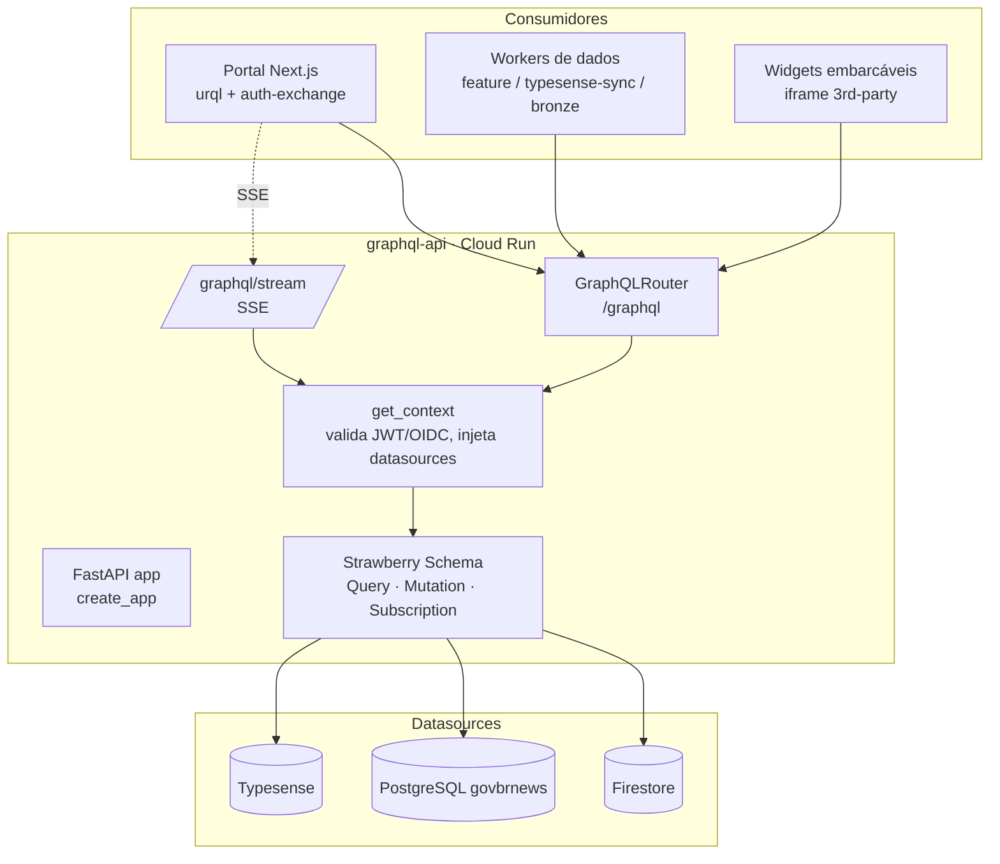

# Arquitetura

## Visão de componentes



!!! info "Portal = consumidor único via GraphQL"
    Após o desacoplamento BD→GraphQL, o **portal não fala mais direto** com
    Firestore nem Typesense nas superfícies de conteúdo público e de features.
    Tudo passa por este serviço: artigos/busca/temas/relacionados/contagens
    (Typesense) e clipping/marketplace/releases/telegram (Firestore). Os únicos
    backends que o portal ainda toca diretamente são os de borda (auth/sessão),
    não os de dados.

## Code-first com Strawberry

O schema é **code-first**: tipos e resolvers são classes Python decoradas
(`@strawberry.type`, `@strawberry.field`). Não há `.graphql` mantido à mão como
fonte — o SDL é **derivado** do código (ver [Referência](reference/schema.md) e
`scripts/export_schema.py`).

A raiz é composta por mixins, um por feature, em `src/graphql_api/schema/__init__.py`:

```python
@strawberry.type
class Query(
    HealthQuery, ArticleQuery, SearchQuery, MetadataQuery, AnalyticsQuery,
    ClippingQuery, MarketplaceQuery, PushQuery, WidgetQuery, InternalQuery,
):
    pass

@strawberry.type
class Mutation(ClippingMutation, MarketplaceMutation, PushMutation, InternalMutation):
    pass

@strawberry.type
class Subscription(AgentSubscription):
    pass

schema = strawberry.Schema(query=Query, mutation=Mutation, subscription=Subscription)
```

Cada resolver vive em `schema/resolvers/<feature>.py` e os tipos em
`schema/types/`. Adicionar uma feature = um novo mixin + tipos, plugado na raiz.

!!! warning "O scalar de IDs é `String`, não `ID`"
    Este schema **não define** o scalar `ID`. Todo identificador é `String!`
    (ex.: `clipping(id: String!)`, `article(uniqueId: String!)`). Operações do
    cliente escritas com `ID!` falham com `Unknown type 'ID'`. Foi a causa de um
    drift sistêmico na R1 — ver [Exemplos › Gotchas](exemplos.md#gotchas).

## App FastAPI

`create_app()` (em `app.py`, factory) monta:

- O `GraphQLRouter(schema, context_getter=get_graphql_context)` em `/graphql`
  (queries e mutations — HTTP POST). Um `GET /graphql` no browser serve o
  **GraphiQL** nativo do Strawberry — ver [Exemplos › Playground](exemplos.md#playground-graphiql).
- Um endpoint dedicado `/graphql/stream` para **subscriptions via SSE**
  (ver [Subscriptions & SSE](subscriptions-sse.md)).
- `CORSMiddleware`, `/health`, e o `lifespan` que instancia os datasources.

### CORS

```python
cors_origins = os.environ.get("CORS_ALLOW_ORIGINS", "*").split(",") or ["*"]
```

O default é `*` — seguro porque o schema **público** (sem `Authorization`) só
expõe queries read-only de notícias/temas/agências/widgets; mutations e queries
autenticadas exigem o header. Widgets embarcáveis em sites de terceiros dependem
desse CORS aberto. Em produção a infra pode restringir
(`CORS_ALLOW_ORIGINS=https://destaques.gov.br,...`).

!!! note "CSP é do lado do cliente"
    CORS aqui não basta para o browser: o portal precisa incluir a origem deste
    serviço no `connect-src` do **Content-Security-Policy** dele, senão o browser
    bloqueia o fetch antes de sair. Foi a causa-raiz nº 1 da R1. Ver
    [auth](auth.md) e o catálogo de drift.

### Healthcheck

`GET /health` → `{"status": "ok"}`. Usado pelas probes do Cloud Run
(`startup_probe`/`liveness_probe`).

## Falha silenciosa de datasources no startup

Padrão **deliberado** (`lifespan.py`): se um datasource não puder ser
instanciado (env var ausente/ inválida), ele vira `app.state.<ds> = None` com um
warning no log, e o app sobe assim mesmo. Resolvers que dependem daquele
datasource retornam erro em runtime. Isso permite subir o serviço mesmo com uma
integração faltando — útil em dev. Não troque por hard-fail.
