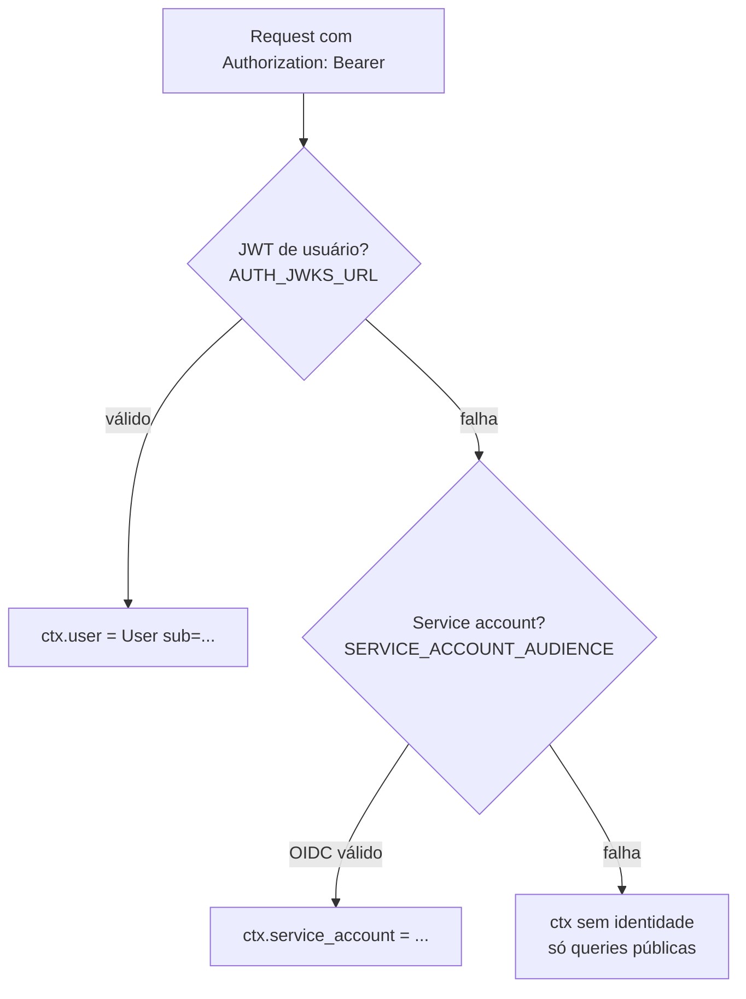

# Autenticação

O serviço autentica **duas** classes de chamadores, em camadas, no
`get_context()`:



## 1. Usuário final — JWT do Keycloak

O portal envia `Authorization: Bearer <access_token>` (JWT do Keycloak, realm
`destaquesgovbr`). `auth/jwt.py` valida contra o **JWKS** do realm:

- `AUTH_JWKS_URL` → `…/realms/destaquesgovbr/protocol/openid-connect/certs`
  (chaves buscadas e cacheadas).
- Valida assinatura, `exp` e `sub` sempre; `iss` quando `AUTH_ISSUER` é dado.
- O id do usuário é o **`sub`** do token: `User(id=payload["sub"], …)`.

```python
require_claims = ["exp", "sub"]
# ...
return User(id=payload["sub"], email=..., roles=...)
```

!!! info "Falha de auth é silenciosa por design"
    Token ausente/expirado/inválido deixa `ctx.user = None` — **queries públicas
    seguem funcionando**. Só campos guardados por `IsAuthenticated` é que falham
    com erro de autenticação. Isso mantém o schema público (notícias, temas,
    busca, widgets) acessível sem login.

### Permissões declarativas

Campos autenticados usam `permission_classes=[IsAuthenticated]`. A autoria é
resolvida por contexto: `Clipping.isAuthor` compara `authorUserId` com
`ctx.user.id`, e resolvers de mutação (editar/excluir clipping) exigem que o
usuário seja o autor.

### O token no browser (decisão da R1)

Para o urql client-side enviar o `Bearer`, o portal expõe o `accessToken` na
sessão NextAuth (lido via `/api/auth/session`). Trade-off aceito: o token fica
legível por JS (um XSS poderia exfiltrá-lo), mitigado por TTL curto (~5 min) +
refresh + CSP. Mitigação futura: proxy GraphQL server-side para manter o Bearer
fora do browser.

!!! warning "CSP do portal precisa liberar este serviço"
    O browser bloqueia o fetch ao graphql-api se a origin dele não estiver no
    `connect-src` do **Content-Security-Policy** do portal. CORS aqui não resolve
    isso — é política do lado do cliente. Foi a causa-raiz nº 1 da R1: tudo
    funcionava via `curl` (sem CSP) e quebrava no browser. Ver
    [Subscriptions & SSE](subscriptions-sse.md) e o catálogo de drift.

## 2. Service account — OIDC do Google

Workers de dados (feature-worker, typesense-sync-worker, bronze-writer) chamam as
queries/mutations **internas** (`newsForTypesense`, `upsertFeatures`, …) com um
**ID token OIDC** do Google no `Authorization: Bearer`. Quando o JWT de usuário
falha e `SERVICE_ACCOUNT_AUDIENCE` está configurado, o contexto tenta validar o
token como OIDC e popula `ctx.service_account`. Os resolvers internos exigem essa
identidade (`is_internal`).

## OIDC de saída (passthrough do agente)

Há também OIDC **de saída**: a subscription `generateRecortes` faz passthrough do
SSE para o **clipping worker**, que é protegido por IAM. O serviço obtém um ID
token com `audience` = URL do worker via `lib/oidc.py`:

- Em Cloud Run: **metadata server** da instância.
- Fora do Cloud Run (dev local): fallback via **ADC**
  (`google.oauth2.id_token.fetch_id_token`), que exige `roles/run.invoker` da
  identidade ADC no worker.
- Audience local (`localhost`) → retorna `None` (sem header).

Detalhes em [Subscriptions & SSE](subscriptions-sse.md).
