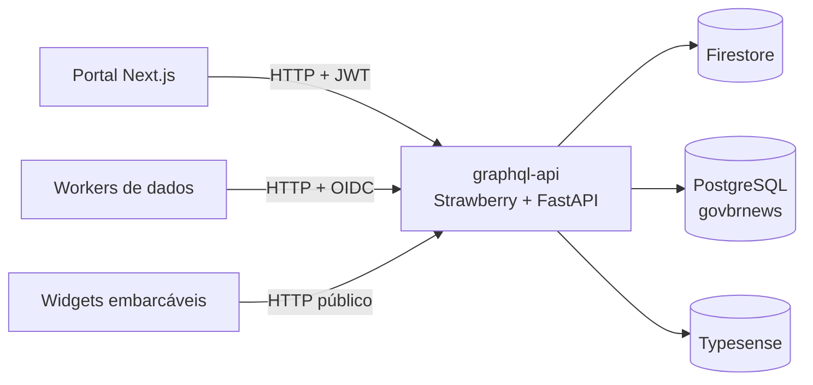

# GraphQL API — Destaques Gov.BR

API GraphQL **unificada** do Destaques Gov.BR. É a fachada de dados única entre
os consumidores da plataforma (portal Next.js, workers de dados) e os backends
de persistência (Firestore, PostgreSQL, Typesense). Substitui a colcha de
retalhos anterior, em que o portal e os workers falavam direto com cada backend
via REST/Firebase Admin/SQL.

## Por que uma fachada GraphQL

- **Desacoplamento.** Os consumidores deixam de conhecer o formato dos backends.
  Trocar Firestore por outra coisa, ou mudar o JOIN do Postgres, não vaza para o
  portal nem para os workers.
- **Schema tipado e único.** Um contrato versionado, introspectável, com um único
  ponto de evolução. A referência é [gerada do código](reference/schema.md).
- **Auth centralizada.** Validação de JWT (usuários) e OIDC (service accounts) em
  um lugar só, com permissões declarativas por campo.

## Stack

| Camada | Tecnologia |
|--------|-----------|
| Schema | [Strawberry GraphQL](https://strawberry.rocks) (code-first, Python 3.12) |
| HTTP | FastAPI + Uvicorn |
| Subscriptions | SSE via `/graphql/stream` (graphql-sse) |
| Deploy | Cloud Run (`destaquesgovbr-graphql-api`), env vars via Terraform |
| Datasources | asyncpg (Postgres), firebase-admin (Firestore), typesense-python |
| Auth | PyJWT + JWKS do Keycloak; OIDC via metadata server / ADC |

!!! tip "Playground interativo"
    A API serve o **GraphiQL** nativo em `GET /graphql` — explore o schema,
    autocomplete e rode queries no browser, sem instalar nada:
    [playground de staging](https://destaquesgovbr-graphql-api-klvx64dufq-rj.a.run.app/graphql)
    · localmente em `http://localhost:8000/graphql`. Ver
    [Exemplos › Playground](exemplos.md#playground-graphiql).

## Mapa da documentação

- **[Arquitetura](arquitetura.md)** — visão de componentes, code-first, CORS, healthcheck.
- **[Datasources](datasources.md)** — Firestore/Postgres/Typesense, DataLoaders, async vs sync.
- **[Autenticação](auth.md)** — JWT de usuário e OIDC de service account.
- **[Subscriptions & SSE](subscriptions-sse.md)** — o agente de recortes em tempo real.
- **[Exemplos](exemplos.md)** — queries e mutations reais, com os _gotchas_.
- **[Referência: Schema (SDL)](reference/schema.md)** — SDL completo, gerado do código.

!!! info "Documentação central"
    Esta é a documentação **profunda** do serviço, versionada junto do código. A
    visão de alto nível e o lugar do serviço na plataforma estão na
    [documentação central do DGB](https://destaquesgovbr.github.io/docs/) (módulo
    GraphQL API).
