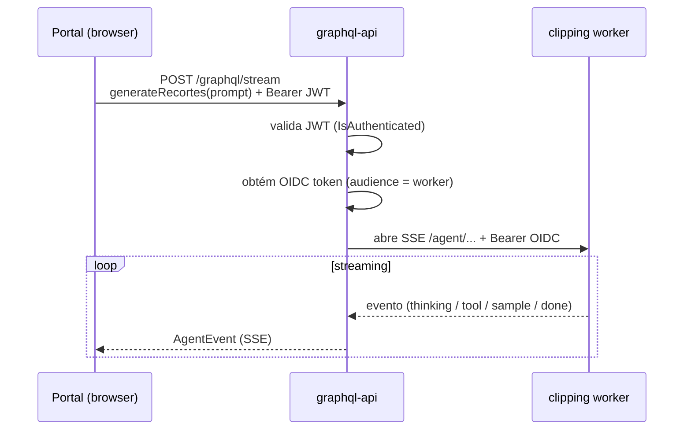

# Subscriptions & SSE

A única subscription do schema é `generateRecortes` — o **agente de IA** que gera
recortes de clipping em tempo real, transmitindo o raciocínio do LLM conforme ele
acontece.

```graphql
type Subscription {
  """Gera recortes em tempo real via agente LLM. Passthrough do SSE do
     worker clipping. Requer autenticacao."""
  generateRecortes(prompt: String!): AgentEvent!
}
```

## Por que SSE e não WebSocket

Subscriptions em GraphQL costumam usar WebSocket (`graphql-ws`). Aqui usamos
**Server-Sent Events** (`graphql-sse`) por dois motivos:

- O fluxo é **unidirecional** (servidor → cliente) e de vida curta (a duração de
  uma geração). SSE é mais simples e atravessa proxies/Cloud Run melhor que WS.
- O agente real roda no **clipping worker** (outro serviço). Este serviço só faz
  **passthrough**: abre o SSE do worker e repassa os eventos. SSE encaixa
  naturalmente nesse padrão de proxy de stream.

## O endpoint `/graphql/stream`

!!! danger "Subscriptions vão para `/graphql/stream`, não `/graphql`"
    `/graphql` serve **só queries e mutations** (HTTP POST). As subscriptions têm
    um endpoint dedicado **`/graphql/stream`** (`text/event-stream`). Um cliente
    que aponte o SSE para `/graphql` recebe 404 / "Failed to fetch". Foi um dos
    bugs da R1 — o portal derivava a URL do SSE errada. O cliente deve transformar
    `…/graphql` → `…/graphql/stream`.

O endpoint responde com headers de streaming:

```python
StreamingResponse(
    generator,
    media_type="text/event-stream",
    headers={
        "Cache-Control": "no-cache",
        "Connection": "keep-alive",
        "X-Accel-Buffering": "no",  # desabilita buffering em Nginx/Cloud Run
    },
)
```

## Fluxo do passthrough



A autenticação tem dois saltos: **usuário → graphql-api** (JWT Keycloak) e
**graphql-api → worker** (OIDC do Google, via `lib/oidc.py`). Ver [auth](auth.md).

## O tipo `AgentEvent` (union)

Cada evento do stream é um membro de uma union — o cliente faz pattern-match no
`__typename`:

| Membro | Significado |
|--------|-------------|
| `AgentEventThinking` | raciocínio em andamento (`message`) |
| `AgentEventToolCall` | o agente chamou uma ferramenta (`tool`, `argsJson`) |
| `AgentEventToolResult` | resultado de uma ferramenta (`tool`, `resultJson`) |
| `AgentEventSampleResult` | amostra de artigos para um recorte (`payloadJson`) |
| `AgentEventAdjusting` | ajustando a estratégia (`message`) |
| `AgentEventDone` | concluído: `recortes`, `explanation`, `suggestedName`, `iterations`, `converged` |
| `AgentEventError` | erro (`message`) |

```graphql
subscription Generate($prompt: String!) {
  generateRecortes(prompt: $prompt) {
    __typename
    ... on AgentEventThinking { message }
    ... on AgentEventDone {
      suggestedName
      recortes { title themes agencies keywords }
    }
    ... on AgentEventError { message }
  }
}
```

!!! note "Dev local vs Cloud Run"
    Em Cloud Run o OIDC sai do metadata server e o worker aceita. Em dev local,
    o fallback ADC só funciona se a sua identidade tiver `roles/run.invoker` no
    worker; sem isso, o stream do agente falha no salto OIDC (o resto do schema
    funciona normalmente).
